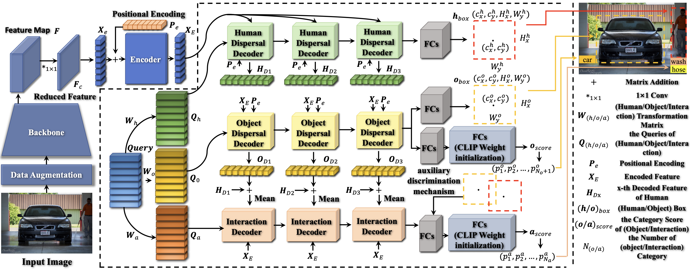

# TED-Net
Code for our paper "<font color=#4169E1>TED-Net: Dispersal Attention for Perceiving Interaction Region in Indirectly-Contact HOI Detection</font>".



## Installation
Our environment was established on the foundation of Ubuntu 22.04 with Python 3.8. Install the pytorch==1.7.1 and torchvision==0.8.2.
```
pip install torch==1.7.1+cu110 torchvision==0.8.2 -f https://download.pytorch.org/whl/torch_stable.html
```

Install the dependencies.
```
pip install -r requirements.txt
```
Clone and build CLIP.
```
git clone https://github.com/openai/CLIP.git && cd CLIP && python setup.py develop && cd ..
```
## Data preparation

### HICO-Det
HICO-Det dataset can be downloaded [here](https://drive.google.com/open?id=1QZcJmGVlF9f4h-XLWe9Gkmnmj2z1gSnk). After finishing downloading, unpack the tarball (`hico_20160224_det.tar.gz`) to the `data` directory.

Instead of using the original annotations files, we use the annotation files provided by the PPDM authors. The annotation files can be downloaded from [here](https://drive.google.com/open?id=1WI-gsNLS-t0Kh8TVki1wXqc3y2Ow1f2R). The downloaded annotation files have to be placed as follows.
```
data
 └─ hico_20160224_det
     |─ annotations
     |   |─ trainval_hico.json
     |   |─ test_hico.json
     |   └─ corre_hico.npy
     :
```

### V-COCO
First clone the repository of V-COCO from [here](https://github.com/s-gupta/v-coco), and then follow the instruction to generate the file `instances_vcoco_all_2014.json`. Next, download the prior file `prior.pickle` from [here](https://drive.google.com/drive/folders/10uuzvMUCVVv95-xAZg5KS94QXm7QXZW4). Place the files and make directories as follows.
```
GEN-VLKT
 |─ data
 │   └─ v-coco
 |       |─ data
 |       |   |─ instances_vcoco_all_2014.json
 |       |   :
 |       |─ prior.pickle
 |       |─ images
 |       |   |─ train2014
 |       |   |   |─ COCO_train2014_000000000009.jpg
 |       |   |   :
 |       |   └─ val2014
 |       |       |─ COCO_val2014_000000000042.jpg
 |       |       :
 |       |─ annotations
 :       :
```
For our implementation, the annotation file have to be converted to the HOIA format. The conversion can be conducted as follows.
```
PYTHONPATH=data/v-coco \
        python convert_vcoco_annotations.py \
        --load_path data/v-coco/data \
        --prior_path data/v-coco/prior.pickle \
        --save_path data/v-coco/annotations
```
Note that only Python2 can be used for this conversion because `vsrl_utils.py` in the v-coco repository shows a error with Python3.

V-COCO annotations with the HOIA format, `corre_vcoco.npy`, `test_vcoco.json`, and `trainval_vcoco.json` will be generated to `annotations` directory.

## Create link
You should use the following code to create symbolic links for the dataset:
```
cd /path/to/TED-Net
mkdir data
ln -s /path/to/dataset/* /path/to/TED-Net/data/
```
Replace /path/to/dataset with the actual path to your dataset and /path/to/TED-Net with the actual path to your project directory.

## Pre-trained model
Download the pretrained model of DETR detector for [ResNet50](https://dl.fbaipublicfiles.com/detr/detr-r50-e632da11.pth), and put it to the `params` directory.
```
python ./tools/convert_parameters.py \
        --load_path params/detr-r50-e632da11.pth \
        --save_path params/detr-r50-pre-2branch-hico.pth \
        --num_queries 64

python ./tools/convert_parameters.py \
        --load_path params/detr-r50-e632da11.pth \
        --save_path params/detr-r50-pre-2branch-vcoco.pth \
        --dataset vcoco \
        --num_queries 64
```

## Training
After the preparation, you can start training with the following commands. 

### HICO-Det
```
sh ./config/hico_s.sh
```

### V-COCO
```
sh ./configs/vcoco_s.sh
```

## Evaluation

You can conduct the evaluation with trained parameters for HICO-Det and V-COCO as follows.
```
# HICO-Det
sh ./config/hico_eval.sh
# V-COCO
sh ./config/vcoco_eval.sh
```

For the official evaluation (reported in paper), you need to covert the prediction file to a official prediction format following [this file](./tools/covert_annot_for_official_eval.py), and then follow [PPDM](https://github.com/YueLiao/PPDM) evaluation steps.

## HICO-Det-IC and V-COCO-IC

### Training on HICO-Det-IC
```
cd /path/to/TED-Net
mv datasets/hico.py ./
cp IC/hico.py datasets/
sh ./configs/hico.sh
```
### Training on V-COCO-IC
```
cd /path/to/TED-Net
mv datasets/vcoco.py ./
cp IC/vcoco.py datasets/
sh ./configs/vcoco.sh
```

## Evaluation on HICO-Det-IC and V-COCO-IC
You can conduct the evaluation with trained parameters for HICO-Det-IC and V-COCO-IC as follows.
```
# HICO-Det-IC
sh ./config/hico_eval.sh
# V-COCO-IC
sh ./config/vcoco_eval.sh
```

## Supplementary
Refer to: https://github.com/YueLiao/gen-vlkt